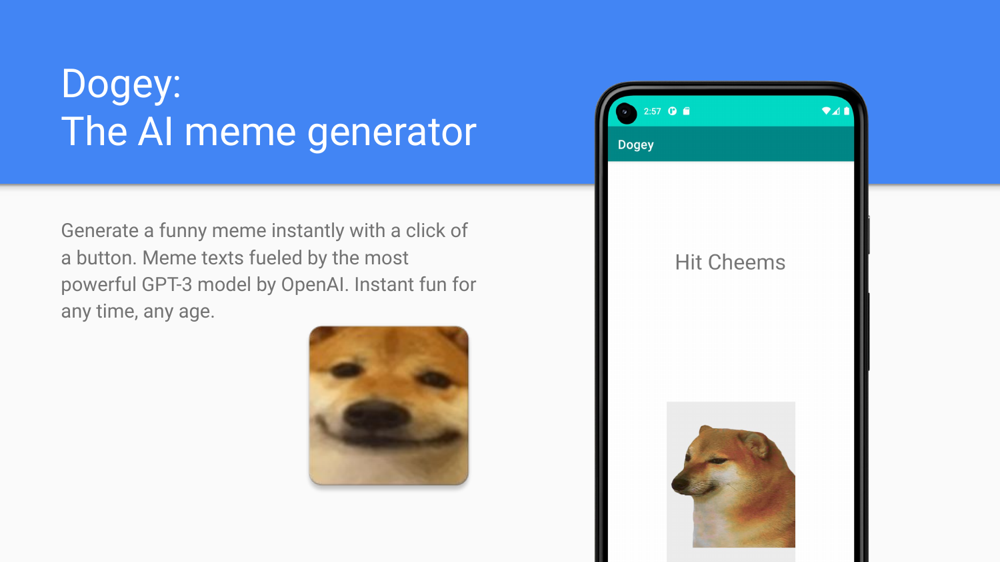
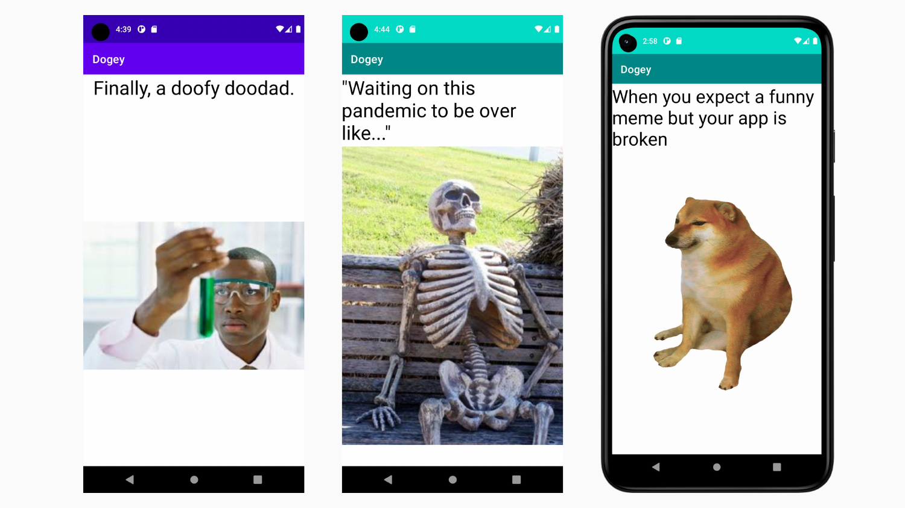

# Dogey: The AI meme generator

A small and compact app, Dogey allows anyone to generate a unique meme with one
click! Text memes are AI-generated, so you will be generating a new meme every
time. Images are limited to 8 options, but extending is super easy; just add its
corresponding GPT prompt, and you are set! A joy for anyone looking to build
their next meme generator, and a load of fun for all ages and users!

## Features

- 🤖 Meme texts are generated by `text-davinci-003`, the most powerful GPT-3
  model by OpenAI!
- 🧩 Super extensible; adding more meme images is a piece of cake.
- 👆 One-click instant meme!
- ⏲️ Built-in dank meme counter.

## Screenshots

